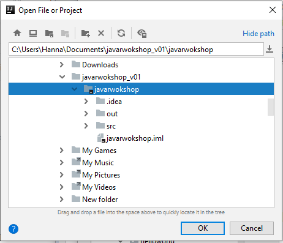
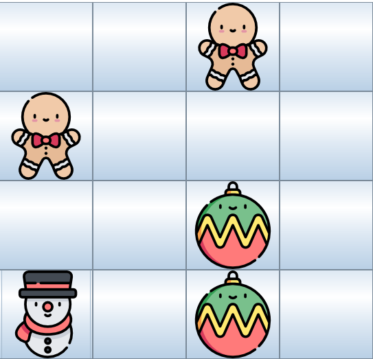

# Java Workshop 


<div class="image-div">
</div>

## Introduction 

Welcome!

The introduction slides, with instructions on how to install the java development enviorment on your computer:

[Download slides](https://docs.google.com/presentation/d/1ccMVm5nXKfPi9ciCNXAgnpB0VLV0Cb7gEislbcAJJYo/edit?usp=sharing)

[Download workshop files (zip)](https://drive.google.com/file/d/1Ho6_IVvl6XwDqQriUP8s7gg44EW3SzPW/view?usp=sharing)

There are two ways to follow this workshop. One is to download the zipe files linked above to your computer and do the tasks on your computer. You will then need to download JDK (java development kit) and and IDE (editor to develop in, we recommend Intellij). Details on this can be found in the slides above.

You then need to unzip the files, and open them in your IDE by selecting the *Open... >project root* (In Intelliji below):



The other way is to just do the tasks directly in your browser using the links that you can find in every task except the last one (which requires an IDE). This does not require you to download anything.

Don't hesitate to ask questions; for example, downloading the JDK and setting the enviorment variable can be tricky, but we're here to help!

Start with any task you want. And have fun!

- Hanna and Saeideh


## Lets do some christmas themed programming!
### Hello World! 

Are you completly new to java, or programming in general? Or maybe you just want to warm up? Start here! 

**Hello World**

A hello world program is a time-honored tradition in programming as a beginners first challange. Enter the repl below in a new tab, or download the zip, and follow the instructions. 

https://repl.it/@hannary/Hello-World-1

As you could see in the above example, There is a class called Main and a method called main. All java code has to be inside a class (but it doesn't have to be called Main, that is just the standard name used in repl). The entry point of a program is the "public static void main(String args[])" method. Java will look for this method to know where to start executing code. Try removing it and see what the compiler says!

**A christmas greeting**

Lets try make a new method after the main method. In the HelloWorld program, after the main method, add a new method:

``` 
public static void christmasGreeting(String personToGreet) {

}
``` 

remove the System.out.println("Hello World!") from the main method and run the program. You should not get any errors or any other output.

Now add a new System.out.println inside the christmasGreeting method:

``` System.out.println("Merry Christmas " + personToGreet);``` 

Inside the main method, add a call to our new ChristmasGreeting method:

``` christmasGreeting("Name"); ```

Name can be anything you want. Now run the program, the output should be "Merry Christmas, Name!"

### Temperature converter and santa checker
Santa clause has decided to make a stand against global warming by declaring that he will only show up if the winter is actually cold, meaning the temperature is below 0 degrees celcius. Lets write a program to help our friends who only know fahrenheit!

Open the following repl in a new tab, or download the program and start it in your ide:

https://repl.it/@hannary/Temperature-converter-and-Santa-checker

As you can see, there is only one lonely print statement in there. Let's change that. 
At the top of the file is an import statement, which let's us use the build in Java Scanner to read input. After the System.out.println statement, add this:

```
Scanner reader = new Scanner(System.in);
int f = reader.nextInt();
System.out.println(f);
```

The first statement creates a reader, that can be used to read user input. The next one saves the next number the user inputs. the third one prints that number. Try it out! (try printing something other than a number.. you will get an error as Java expects a number and don't know what to do with text, for example).

Now let's do some math. The formula for converting Fahrenheit to celcius is: celsius = ((fahrenheit - 32) * 5) /9
Since an int doesnt allow decimals, this is an approximation. But it will do for now.
under the line reading in the value f, add:

```int c = ((f - 32) * 5) /9;```

Now instead of only printing f, change the System.out.print to print the new temperature:

```
System.out.println(c);
```

Change the above print statement to be a little more descreptive. instead of c, write: (c + "degrees in celsous is " + f + " degrees in 

```
System.out.println(f + "degrees in farenheit is " + c + "degrees in celsius");
```

Try it out! 

Now let's add a santa check. We want to print out "Santa is coming!" if the value of c is zero or lower, and "Santa isn't coming" otherwise. Add the following under the lines of code you just added:

```
if(c <= 0){
  //Add system.out.println here
}
else {
  //Add system.out.println here
} 
```

Add the System.out.println() statements with your output inside the if and else clauses.

Try it out! You should now have a santa checker and temperature checker, for all your winter needs.


### A Program for writing a christmas wish list

Goal: a program that lets you make a christmas wish list.
You should be able to add more items, print them out, and quit the program.

Right now, the program lets you add one item, prints it out, and qutis. It needs a loop to run in and decide what to do based on user input!
https://repl.it/@hannary/ChristmasList

**Step one: Before the loop**

At the start of the main method(public static void main(String[] args)), create a string to store the current user input in, and a list to store all of the input in:

``` 
List<String> s = new ArrayList<>();
String userInput;
 ```

Next, after those variables, add a boolean to control the flow of the program:

``` boolean isProgramRunning = true; ```

After that, add a System.out.println statement that prints ""Print q to quit, s to see current list ".

**Step two: in the loop**

Now we add a while loop that runs while the boolean *isProgramRunning* is true:

``` 
while(isProgramRunning){

} 
```

Inside the loop: add these lines to read input from the user and store it in a list and then print it out:

```
userInput = in.nextLine();
gifts.add(userInput)
System.out.println(gifts);
```

Try it out! This program will run forever now, so you will have to kill it to end it.

**Step three: Controlling the loop**

We have three cases: the userInput is 'l', and the gifts should be printed out.
                     the userInput is 'q', and the program should end.
                     the userInput is a new item for the wishlist (a string(, and it should be added to the list.
                     
 Inside the while loop, add an *if else* clause:
 
 ```
 if(userInput.equals("q")){
        isProgramRunning = false;
      }
 ```
 
 Try running the program. It should let you add gifts until you press q.
 
 next, add two more cases:
 
 ```
 else if (userInput.equals("l")){
    //Move the System.out.println that prints the list of gifts here
 }
 else {
    //Move the line that adds gift to the list here.
    //you could also add a System.out.println() that tells the user that a gift has been added!
 }
 ```
 

Move the System.out.printlns into the *else* clauses as specified in the comments above.

There! You have a program to store gifts. Nifty.


### Christmas Tree
It's Christmas time, so today we are going to be drawing a Christmas tree of your chosen size in Java.

https://repl.it/@Saeideh/ChristmasTree

Let's write down what we need to do. Each line consist of spaces for indentation, and stars for the tree. We need to be able to make a pyramids with *.
```
         *            9 spaces,  1 stars, i = 0
        ***           8 spaces,  3 stars, i = 1
       *****          7 spaces,  5 stars, i = 2
      *******         6 spaces,  7 stars, i = 3
     *********        5 spaces,  9 stars, i = 4
    ***********       4 spaces, 11 stars, i = 5
   *************      3 spaces, 13 stars, i = 6
  ***************     2 spaces, 15 stars, i = 7
 *****************    1 spaces, 17 stars, i = 8
*******************   0 spaces, 19 stars, i = 9
```
Now see if we can discern the pattern. See for 1st row there is 1 star. For 2nd there are 3 ,for 3rd there are 5 and so on. So it follows the general rule of 2*(n-1)+1. As our i starts form 0 so (n-1)=i. Thus number of stars in (i+1)th row = 2*i+1.

All is about three loops:

**Step one: Loop for number of rows**
 ```
 for (int i = 0; i < x; i++) {
 ```
 Based on number that user inter, we will have rows. so this loop iterate x times.
 
 **Step two: Loop for printing the Space**
 ```
 for (int j = 0; j < i; j++)
    System.out.print(" ");
 ```
 
 **Step three: Loop for printing the asterisks**
 ```
 for (int k = 0; k < (2 * i + 1) ; j++)
    System.out.print("*");
 ```

There we go :)
## Harder project: Lets create some christmas memories



Or in this case, Christmas Memory. Tha classic game we all love to play.

In this application we are using an old java toolkit called *swing*. It's rarely used for new projects today, but it's useful for making small, lightweight applications to learn java. 

If you run the program, you should see an empty frame.  

We already created the class Card for you. Take a look: It contains an Image, an ID for comparing cards, and two booleans to keep track of if the images/have been found.

In the resources folder, there are 8 images we will use for the cards.

In the beginning of the Board class, we've already created some variables: openCards where we will store open cards, frame where we store the game "frame", and "cards" which stores all cards. We'll now create the cards!

Under the already initiated values mentioned above, we'll add the cards. Each card needs to be added twice, and have an ID and an image:

 ```
//Icons made by https://www.flaticon.com/authors/freepik Freepik from www.flaticon.com
Card card1 = new Card("wreath", "wreath.png");
Card card2 = new Card("wreath", "wreath.png");
Card card3 = new Card("santa-claus", "santa-claus.png");
Card card4 = new Card("santa-claus", "santa-claus.png");
Card card5 = new Card("gingerbread-man", "gingerbread-man.png");
Card card6 = new Card("gingerbread-man", "gingerbread-man.png");
Card card7 = new Card("candy-cane", "candy-cane.png");
Card card8 = new Card("candy-cane", "candy-cane.png");
Card card9 = new Card("deer", "deer.png");
Card card10 = new Card("deer", "deer.png");
Card card11 = new Card("tree", "christmas-tree.png");
Card card12 = new Card("tree", "christmas-tree.png");
Card card13 = new Card("snowman", "snowman.png");
Card card14 = new Card("snowman", "snowman.png");
Card card15 = new Card("bauble", "bauble.png");
Card card16 = new Card("bauble", "bauble.png");
 ```  

After creating the cards, we'll go into the *setUpBoard()* method. We'll add all the cards to the array "cards" to make handeling them a little bit easier:

 ```
cards.add(card1);  cards.add(card2);  cards.add(card3);  cards.add(card4);  cards.add(card5);
cards.add(card6);  cards.add(card7);  cards.add(card8);  cards.add(card9);  cards.add(card10);cards.add(card11); cards.add(card12); cards.add(card13); cards.add(card14); cards.add(card15);
cards.add(card16);
 ```

Phew! Next, lets shuffle the cards so they'll show up at different places of the board:

```
Collections.shuffle(cards);
```


Next, we'll go through the array and add every card to the game frame, set the icon to null (so that the cards will be empty at the start of the game), and then we'll add a *listener* to each card. Since we are using swing components, the listener method is 
built in. It allows us to tell java that we want the application to listen for a click of the button. When the button is clicked, the listener method will be called:

```
for(Card card : cards) {
     frame.add(card);
     card.setIcon(null);
     card.addActionListener(this);
  }
```

Try running the program. You should see a matrix of blank cards. If you try clicking one, nothing will happen. We are not doing anything in the listener, so the application isn't doing anything when we click.
The listener method inherited from swing is called " actionPerformed(ActionEvent e)". *Locate it under the setUpBoard() method.*

Add this to the top of the method: 

```
Card justOpened = ((Card)e.getSource());
justOpened.togglePictureShowing(true);
```

We just got the card from the event, and set it as showing. Try running the program. You should be able to open the cards now.

We need a way to keep track of how many, and which cards are currently open. Ad this after the two other lines:

```
openCards.add(justOpened);
```

We now have a program that shows empty cards. When a cards is clicked, a listener is called and in the listener we tell the program to show the image of the clicked card and store all open cards in an array. Nice.

## Adding logic

Go back to the very top of the actionPerformed method. As soon as the user clicks a card, we want to check if two cards are currently showing:

```
if(openCards.size()==2){


}
```
If two cards are open, we can retrive them from the openCards array. Add the following **inside** the if clause:

```
Card firstOpen = openCards.get(0);
Card secondOpen = openCards.get(1);
 ```

Now lets see what we want to do with these two open cards. First, we want to check if they match. Then, we want to close them if they don't match. There are two prepared methods that matches these cases. Lets call them with our two cards:

```
 checkIfMatch(firstOpen, secondOpen);
 closeCards(firstOpen, secondOpen);
 ```
 
We need to implement the checkIfMatch() and closeCards() methods. They exist, but have no code. We'll start with checkIfMatch, located under the actionPerformed method. Inside it, we'll check if the cards match by comparing the id's of the cards:

```
 if(firstOpen!=secondOpen &&  firstOpen.getId().equals(secondOpen.getId())){
           
    }
```

What we do here is asking "get the it of the first open card. Is it equal to the id of the second open card?"

If the answer is yes, we need to set the card to "found" so that they can't be closed again. Add this *inside* the if:

```
firstOpen.setAsFound();
secondOpen.setAsFound();

```

There! Let's move on to the closeCards method, under the checkIfMatch method. In the Cards class, you can look at the toggleImageShowing method. It only toggles the image of cards that aren't set to found. Add this at the top of closeCards:

```
firstOpen.togglePictureShowing(false);
secondOpen.togglePictureShowing(false);
```

The last thing we'll do inside the closeCards method is clear the array of open cards, since no cards are open anymore (except for the "found" cards, that we consider "out of the game"):

```
openCards.clear();
```


Try it out!

## Playing again

To add a play again button, go into the "Main" class. In the constructor, create a new "try again button", and add it to the main frame:

```
JButton tryAgain = new JButton(("Try again!"));
tryAgain.addActionListener(this);
mainFrame.add(tryAgain, BorderLayout.SOUTH);
```

Notice the value "BorderLayout.SOUTH". This decides where the button is located on the board. You can try other values, such as "BorderLayout.NORTH" or "BorderLayout.EAST" to see where you want the button.

Now we want to add what should happen when we click the "try again" button. In the Main class, look for the *actionPerformed(e)* method. So what do we want to do when the button is clicked? If the player wants to play again, the board needs to be set upp again. Inside actionPerformed(e), add the line:

```
 board.setUpBoard();
```
