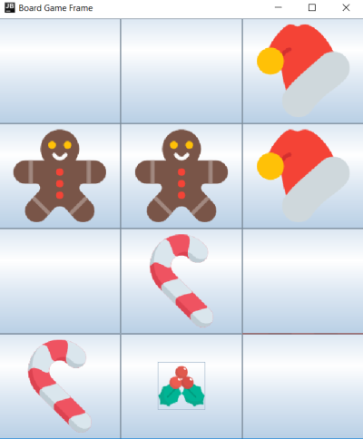

# Java Workshop WORK IN PROGRESS :)

## Introduction

TODO: add introduction text!"

TODO: Add instruction on how to download, install JDK!

TODO: Add instruction on how to install IDE!

## Lets do some christmas themed programming!

### Hello World! Try this out if you've never done it before

https://repl.it/@hannary/Hello-World


### A Program for writing a christmas wish list

Goal: a program that lets you make a christmas wish list.
You should be able to add more items, print them out, and quit the program.

Right now, the program lets you add one item, prints it out, and qutis. It needs a loop to run in and decide what to do based on user input!
https://repl.it/@hannary/ChristmasList (DONE: https://repl.it/@hannary/DoneChristmasList)

**Step one: Before the loop**

At the start of the main method, create a string to store a gift in, and a list to store the gift strings in:

``` List<String> gifts = new ArrayList<String>();
String gift;
 ```

Next, add a boolean to control the flow of the program:

``` boolean isProgramRunning = true; ```

After that, add a System.out.println statement that prints ""Print q to quit, s to see current list ".

**Step two: in the loop**
Now we add a while loop that runs while the boolean is true:

``` while(isProgramRunning){

} 
```

Inside the loop, add this line to read input from the user and store it in a list, and then print it ouy:

```
gift = in.nextLine();
gifts.add(gift)
System.out.println(gifts);
```

Try it out! This program will run forever now, so you will have to kill it to end it.

**Step three: Controlling the loop**

We have three cases: the input is 'l', and the gifts should be printed out.
                     the input is 'q', and the program should end.
                     the input is a string, and it should be added to the list.
                     
 Inside the loop, add an if else clause:
 ``` if(gift.equals("q"){
        isProgramRunning = false;
      }
 ```
 
 Try running the program. It should let you add gifts until you press q.
 
 next, add two more cases:
 
 ```
 else if (gift.equals("l"){
    //Move the System.out.println that prints the list of gifts here
 }
 else {
    //Move the line that adds gift to the list here.
    //you could also add a System.out.println() that tells the user that a gift has been added!
 }
 ```
 


 
 
 
 


### Temperature converter and santa checker
Santa clause has decided to make a stand against global warming by declaring that he will only show up if the winter is actually cold, meaning the temperature is below 0 degrees celcius. Lets write a program to help our friends who only know fahrenheit!

https://repl.it/@hannary/Temperature-converter-and-Santa-checker

TODO: Come up with a third program and add instructions. Plus points if christmas themed.

### fourth program

TODO: Come up with a fourth program and add instructions. Plus points if christmas themed.

## Harder project: Lets create some christmas memories



Or in this case, Christmas Memory. Tha classic game we all love to play.
TODO: Add instructions and code. And fix the terrible pictre

### Markdown

Markdown is a lightweight and easy-to-use syntax for styling your writing. It includes conventions for

```markdown
Syntax highlighted code block

# Header 1
## Header 2
### Header 3

- Bulleted
- List

1. Numbered
2. List

**Bold** and _Italic_ and `Code` text

[Link](url) and 
```

For more details see [GitHub Flavored Markdown](https://guides.github.com/features/mastering-markdown/).

### Jekyll Themes

Your Pages site will use the layout and styles from the Jekyll theme you have selected in your [repository settings](https://github.com/hanna-ry/java_workshop/settings). The name of this theme is saved in the Jekyll `_config.yml` configuration file.

### Support or Contact

Having trouble with Pages? Check out our [documentation](https://help.github.com/categories/github-pages-basics/) or [contact support](https://github.com/contact) and we’ll help you sort it out.
